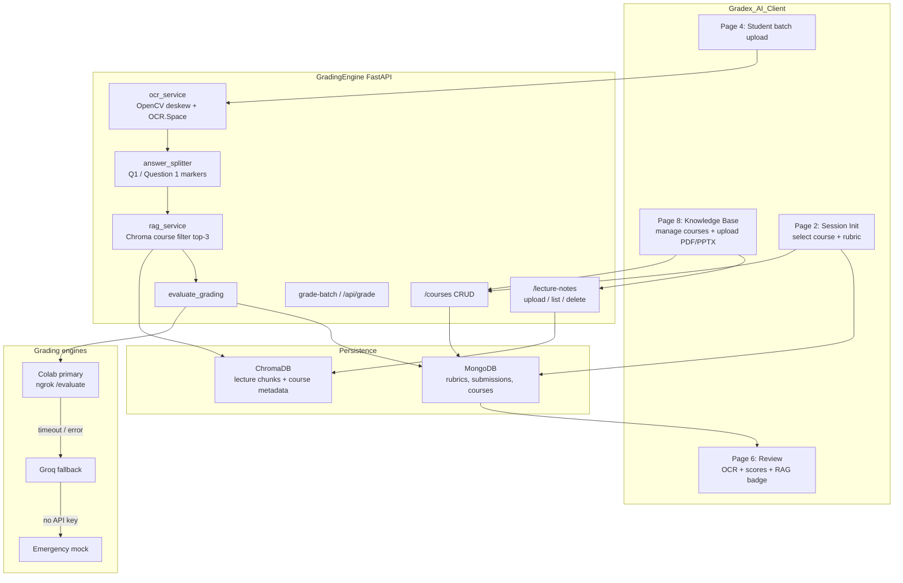
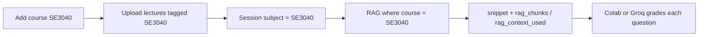

# GradingEngine Architecture

## End-to-end grading flow



## Knowledge Base ↔ grading alignment



## Per-question grading path

1. OCR produces one full transcript.
2. Local regex split buckets answers by `Q1` / `Question 1` markers (else full text per question).
3. For each rubric question: RAG enrich → Colab → Groq → emergency.
4. Scores are summed; response includes `grading_source`, `rag_context_used`, `rag_chunks`.

## Local Colab mock (when live Colab is down)

```bash
# Terminal A
set COLAB_USE_MOCK=1
python colab/colab_evaluate_server.py

# In .env (or for the smoke test via --with-local-colab):
COLAB_EVALUATE_URL=http://127.0.0.1:5000/evaluate

# Terminal B (or one-shot)
python -m app.scripts.test_per_question_grading --with-local-colab
```

For normal grading, set `COLAB_EVALUATE_URL` in `.env` to your live ngrok `/evaluate` URL.
If it is empty/unset, Colab is skipped and Groq is used.

## Session identity (rubric + each submission)

Copied from Session Initialization onto the rubric, then onto every graded student:

- `subject_code`, `subject_name` (name auto-filled from `courses`)
- `year`, `month`, `semester` (dropdowns)
- `session_name` ∈ Final Examination | Mid Term Examination | Tutorial Examination | Quiz
- `rubric_ref` on submissions
## RAG snippets for cognitive analysis

Each graded question stores the retrieved lecture text under
`evaluation.rag_per_question.<q_no>.rag_snippet` (plus `rag_chunks` /
`rag_context_used`). Teammates can use student OCR + these snippets from Mongo
without needing the local `chroma_db/` folder.
