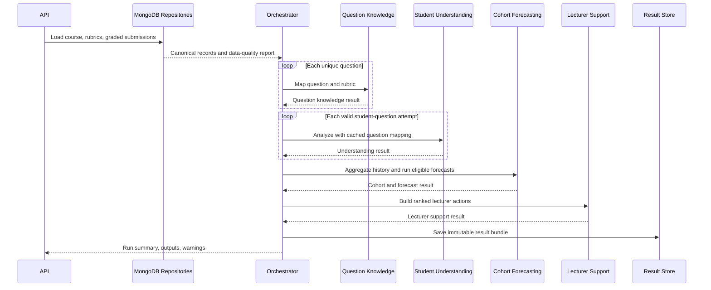

# Agent and Model Integration Plan

**Status:** Approved design package for review  
**Date:** 2026-08-03  
**Architecture:** Four typed agents inside one orchestrated FastAPI service

## 1. Migration from the current workflow

The current repository has `QuestionKnowledgeAgent`, `AnswerMisconceptionAgent`, and `CohortPredictionAgent`. The target workflow keeps compatible contracts while clarifying responsibility:

| Current component | Target component | Change |
|---|---|---|
| QuestionKnowledgeAgent | Question Knowledge Agent | Add rubric contract, semantic mapping, knowledge citations, question type, and difficulty |
| AnswerMisconceptionAgent | Student Understanding Agent | Preserve report values; add rubric mastery and bounded misconception extraction |
| CohortPredictionAgent | Cohort Forecasting Agent | Keep analytics; add temporal features and validated forecasts |
| Part of cohort output / absent | Lecturer Support Agent | New responsibility for ranked interventions and review workflow |

Existing endpoints and contracts remain backward compatible while v2 contracts are introduced.

## 2. Shared principles

- Agents are not autonomous chatbots.
- Agents do not query MongoDB directly; repositories and normalization run first.
- Agents do not persist results; the orchestrator persists the final run.
- Models are accessed through typed protocols and the Model Registry.
- Every optional-model failure returns a warning and defined fallback.
- GradingEngine marks are authoritative.
- Forecasts remain disabled until evaluation gates pass.
- LLMs, if used, are bounded extractors/generators with schema validation and evidence.

## 3. Agent 1: Question Knowledge Agent

### Input

```text
RunContext
CourseRecord
AssessmentRecord
QuestionRecord
```

### Models and tools

1. Canonical topic resolver.
2. Semantic topic/rubric mapper.
3. Required-level Bloom classifier.
4. Question-structure classifier.
5. Optional course-material retriever.

### Output

```text
question_id
canonical_topic_ids and scores
concept_ids
rubric criteria
required_bloom_level
question_type
difficulty
source citations
mapping confidence
status and warnings
```

### Fallbacks

- Semantic mapper unavailable → declared rubric topic or token candidates.
- Bloom model unavailable → explicit heuristic result.
- Retrieval unavailable → rubric/model-answer evidence only.
- Low confidence → partial status and lecturer review flag.

The agent runs once per unique question version, not once per student.

## 4. Agent 2: Student Understanding Agent

### Input

```text
RunContext
QuestionKnowledgeResult
StudentAttemptRecord
```

### Models and tools

1. Existing authoritative score normalization.
2. Optional answer similarity model.
3. Concept/rubric-criterion coverage.
4. Demonstrated-level Bloom classifier.
5. Misconception detector.

### Output

```text
student_id_pseudonymous
question_id
marks_obtained and max_marks
performance_score
rubric_mastery
concept_score
cognitive_score
required and demonstrated Bloom levels
misconceptions with answer evidence
weak concepts
learning indicator
analysis confidence
status and warnings
```

### Rules

- Do not recalculate or alter `marks_obtained`.
- Missing answer text disables semantic/misconception features only.
- Missing criteria breakdown reduces detail but does not discard the attempt.
- Student-facing feedback and lecturer-facing diagnosis are separately authorized.

## 5. Agent 3: Cohort Forecasting Agent

### Input

```text
RunContext
QuestionKnowledgeResults
StudentUnderstandingResults
Historical canonical assessments before cutoff
ForecastTarget
```

### Models and tools

1. Question, student, weak-topic, misunderstood-question, and cognitive-gap analytics.
2. Explicit rule or model weak-topic mode.
3. Historical recurrence and trend feature builder.
4. Topic forecaster.
5. Question-structure predictor.
6. Student/cohort performance-risk predictor.
7. Forecast calibrator and support checker.

### Output

```text
question summaries
student summaries
weak topics
misunderstood questions
cognitive gaps
historical trends
topic forecasts
question-structure forecasts
student/cohort risk forecasts
forecast eligibility and model versions
status and warnings
```

### Rules

- Exclude failed attempt analyses from aggregates and report their count.
- Keep historical summaries when forecast models are unavailable.
- Never use target-assessment information in forecast features.
- Every probability includes training range, calibration status, and support decision.

## 6. Agent 4: Lecturer Support Agent

### Input

```text
RunContext
QuestionKnowledgeResults
StudentUnderstandingResults
CohortForecastResult
Approved course-resource index
RecommendationPolicyVersion
```

### Tools

1. Deterministic recommendation rules.
2. Course-resource retrieval.
3. Optional recommendation ranker after feedback data exists.
4. Optional controlled practice-question generator after approval gates.

### Output

```text
recommendation_id
action_type
priority
affected scope
topic and concept IDs
reason codes
evidence references
suggested resources or activities
forecast dependency
approval status
expiry/review date
```

### Rules

- Recommendations are actionable, not generic encouragement.
- Observed weakness and forecast evidence remain distinguishable.
- Individual student identities require stricter authorization than cohort summaries.
- Generated questions remain drafts until lecturer approval.

## 7. Model Registry entries

| Registry name | Protocol | Consumer |
|---|---|---|
| `answer_similarity` | `score(reference, answer)` | Student Understanding |
| `required_bloom` | `predict_question(text)` | Question Knowledge |
| `demonstrated_bloom` | `predict_answer(question, answer)` | Student Understanding |
| `topic_mapper` | `map_question(question, rubric, course)` | Question Knowledge |
| `knowledge_retriever` | `retrieve(query, filters)` | Question Knowledge and Lecturer Support |
| `misconception_detector` | `detect(context, answer)` | Student Understanding |
| `weak_topic` | `rank(topic_features)` | Cohort Forecasting |
| `topic_forecaster` | `forecast(candidate_features, target)` | Cohort Forecasting |
| `structure_forecaster` | `forecast(history, target)` | Cohort Forecasting |
| `performance_risk` | `predict(history, target)` | Cohort Forecasting |
| `recommendation_policy` | `recommend(evidence)` | Lecturer Support |
| `practice_generator` | `generate(approved_constraints)` | Lecturer Support |

Every registry result includes model or policy version, manifest, load status, and error. Rule policies are versioned capabilities even though they are not trained models.

## 8. Orchestration sequence



## 9. Run context and idempotency

The input hash includes canonical source IDs/checksums, analysis cutoff, forecast target, thresholds, model/policy versions, feature/topic/label schema versions, and curriculum version where available.

The same input and versions may reuse a completed immutable run. A model, policy, source, cutoff, or option change creates a new run.

## 10. Status model

- `success`: all required capabilities completed and any forecast is eligible.
- `partial`: useful output exists, but an optional capability failed, abstained, or lacked data.
- `failed`: no trustworthy result for the requested scope.
- `review_required`: valid output exists but a low-confidence mapping, sensitive risk result, or generated draft needs lecturer approval.

Item-level failure does not automatically fail unrelated students or questions.

## 11. Fallback matrix

| Failure | Continue with | Warning |
|---|---|---|
| MongoDB unavailable | No run | `source_unavailable` |
| Missing rubric question | Quarantine affected result | `question_join_failed` |
| Topic mapper unavailable | Declared topic/token candidate | `topic_mapper_unavailable` |
| Bloom model unavailable | Heuristic or unknown | `bloom_fallback_used` |
| Missing answer text | Score-only analytics | `answer_text_unavailable` |
| Misconception model unavailable | Rubric/concept gaps only | `misconception_unavailable` |
| Weak-topic classifier unavailable | Versioned deterministic rule | `weak_topic_rule_used` |
| Forecast unsupported | Historical analytics only | `forecast_unavailable` |
| Resource retrieval unavailable | Action without resource link | `resource_retrieval_unavailable` |
| Generator unavailable | Omit draft question | `generation_unavailable` |

## 12. Testing

- Contract tests for every input/output and confidence bound.
- Model-adapter tests independent from agents.
- Agent tests with fake repositories and model providers.
- Orchestrator order, cache reuse, idempotency, and failure-isolation tests.
- Security tests ensuring student text is not logged.
- Forecast leakage tests proving target-assessment exclusion.
- End-to-end MongoDB document fixture tests.
- Backward-compatibility tests for the existing three-agent endpoint.

## 13. Acceptance criteria

- Each agent has one typed `run` interface and declared dependencies.
- Models are accessed through adapters/providers rather than hidden imports.
- Agent 1 runs once per unique question and is reused for all students.
- Agent 2 preserves GradingEngine marks under every fallback.
- Agent 3 returns no probability when forecast eligibility fails.
- Agent 4 produces evidence-backed, reviewable actions.
- A single failed student answer does not prevent valid cohort analytics.
- Every persisted run records input hash, cutoff, versions, status, and warnings.

