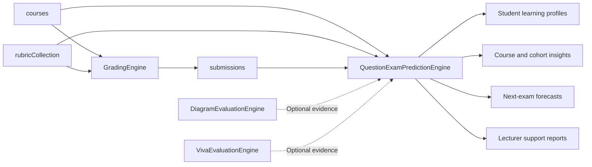
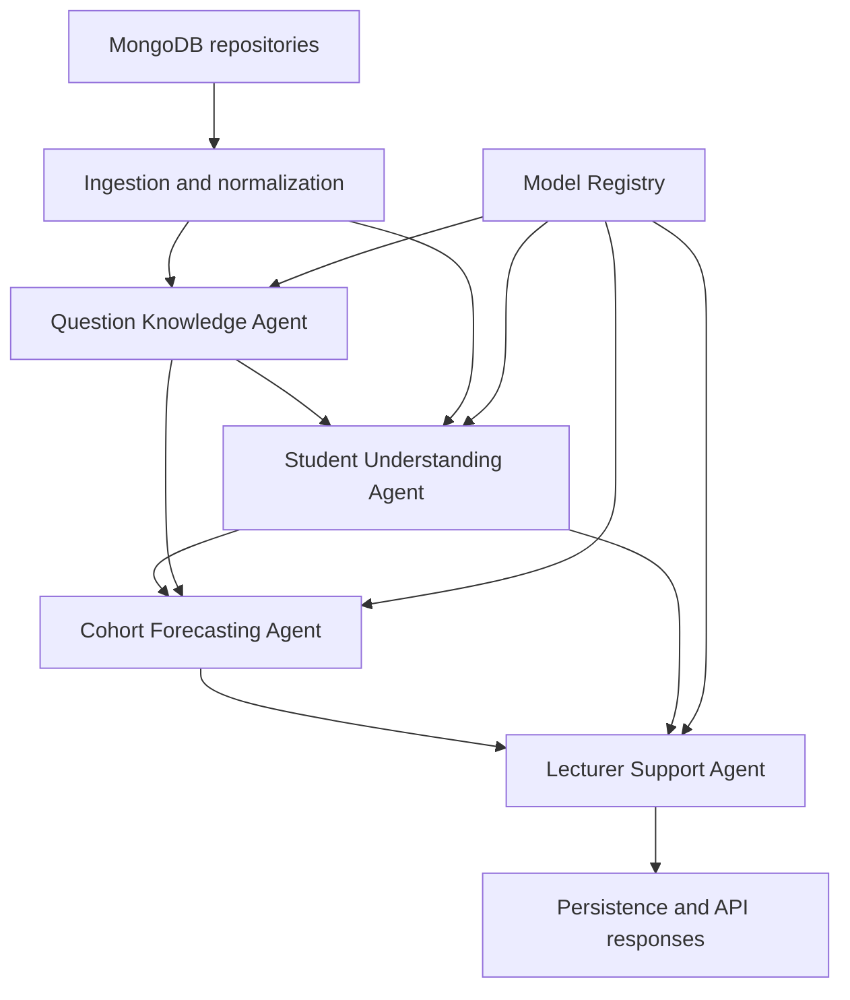

# QuestionExamPredictionEngine Master Plan

**Status:** Approved design package for review  
**Date:** 2026-08-03  
**Component:** QuestionExamPredictionEngine  
**Upstream component:** GradingEngine  
**Related components:** DiagramEvaluationEngine and VivaEvaluationEngine

## 1. Purpose

QuestionExamPredictionEngine is the learning-intelligence component of the overall evaluation platform. It does not replace GradingEngine and must not silently recalculate authoritative marks. It consumes completed grading records and turns them into:

- per-student learning profiles;
- question and cohort performance summaries;
- weak-topic and misconception evidence;
- cognitive and Bloom-level gaps;
- historical assessment patterns;
- next-exam topic, structure, and performance-risk forecasts; and
- evidence-backed lecturer teaching recommendations.

The engine distinguishes three kinds of output:

1. **Observed:** facts directly present in grading records, such as marks and rubric results.
2. **Diagnosed:** deterministic or model-derived interpretations of completed work.
3. **Forecast:** predictions about a future assessment, always accompanied by model version, confidence, training range, and evaluation status.

## 2. Platform boundary

Confirmed source collections are `courses`, `rubricCollection`, and `submissions`. Diagram and viva evidence are optional future inputs and use explicit adapters; the first production release does not depend on them.

## 3. Goals

- Read GradingEngine data by `subject_code`, rubric, session, and student.
- Normalize external MongoDB documents into stable internal contracts.
- Preserve the original score, maximum mark, grading source, and source document IDs.
- Produce per-question, per-topic, per-student, per-session, and longitudinal course analytics.
- Identify weak topics, misunderstood questions, cognitive gaps, and at-risk students.
- Forecast both likely next-exam content and expected student/cohort performance risk.
- Generate lecturer actions that cite the evidence that triggered each recommendation.
- Keep model loading, versioning, evaluation, and fallbacks auditable.
- Continue returning useful diagnostics when optional models are unavailable.

## 4. Non-goals

- Replacing GradingEngine or modifying its marks.
- Calling token overlap or a historical slope a future forecast.
- Publishing an LLM opinion as a calibrated probability.
- Automatically publishing generated exam questions without lecturer approval.
- Storing raw student answers in lecture-material vector collections.
- Requiring autonomous or conversational agents.
- Building a separate microservice for every internal agent in the first release.

## 5. Inputs and forecast eligibility

Required inputs are course metadata, an assessment rubric, graded submissions, stable question numbers, per-question scores, and maximum marks. Rubric criteria, model answers, question-level answer text, topics, Bloom levels, question types, difficulty labels, and reliable assessment dates substantially improve the available diagnosis and forecast.

The engine may always produce diagnostics from valid completed assessments. It publishes forecasts only when the relevant model manifest states that the course and available history are supported. Forecast features use only data available before the target assessment.

When course-specific history is too small, the engine returns one of:

- a frequency/recency baseline clearly labelled as a baseline;
- a validated cross-course model with a course-support declaration; or
- `forecast_unavailable` with the reason and missing requirements.

## 6. Target architecture

Use one FastAPI service with four typed internal agents and a linear orchestrator.

Agents are typed workflow components. They validate inputs, call domain services and model adapters, attach warnings and evidence, and return Pydantic contracts. The orchestrator owns execution order, idempotency, persistence, and run status.

## 7. Agent responsibilities

### 7.1 Question Knowledge Agent

- Normalize question and rubric information.
- Resolve canonical topic and concept identifiers.
- Determine required Bloom level, question type, difficulty, and marks profile.
- Retrieve relevant course material when a knowledge index exists.
- Return evidence citations and mapping confidence.

### 7.2 Student Understanding Agent

- Preserve authoritative marks from GradingEngine.
- Calculate normalized performance and learning indicators.
- Analyze rubric-criterion mastery, concept coverage, cognitive alignment, and misconceptions.
- Produce student-level and question-level evidence without changing the grade.

### 7.3 Cohort Forecasting Agent

- Aggregate student analyses by topic, question, session, and course.
- Detect weak topics, misunderstood questions, cognitive gaps, and risk groups.
- Build historical recurrence and performance features.
- Run validated next-exam topic, structure, and performance-risk models.
- Omit probabilities when the forecast gate is not satisfied.

### 7.4 Lecturer Support Agent

- Convert diagnoses and forecasts into ranked teaching actions.
- Explain why each action is recommended.
- Cite affected topics, questions, students/cohort segments, and forecast evidence.
- Recommend reteaching, examples, revision sessions, practice tasks, and assessment adjustments.
- Keep generated questions in draft/review state.

## 8. End-to-end data flow

1. A request identifies `subject_code` and an analysis cutoff or target session.
2. Repositories load the course, rubrics, and graded submissions.
3. The normalization layer joins rubric question numbers with evaluation result `q_no` values.
4. The orchestrator hashes normalized inputs and model versions.
5. Question Knowledge Agent runs once per unique rubric question.
6. Student Understanding Agent runs once per student-question result.
7. Cohort Forecasting Agent aggregates completed analyses and constructs time-safe features.
8. Validated forecast adapters run only when their model manifests permit it.
9. Lecturer Support Agent ranks actions from observed, diagnosed, and forecast evidence.
10. The orchestrator persists an immutable run bundle and returns a summary.

## 9. Current capability map

| Capability | Current state | Target state |
|---|---|---|
| Answer similarity | Saved SentenceTransformer used by local grading | Optional supporting feature; GradingEngine mark remains authoritative |
| Bloom analysis | Two-class TF-IDF/logistic pilot plus six-level heuristic fallback | Independently evaluated six-class model |
| Weak-topic analysis | Feature aggregation plus deterministic default path and saved classifier | Lecturer-labelled, evaluated classifier with explicit rule fallback |
| Topic matching | Token-overlap matching to declared topics | Semantic mapping with canonical topics and evidence |
| Historical trends | Yearly averages and linear slope | Rich recurrence, marks, Bloom, structure, and performance features |
| Future topic forecast | Not implemented | Temporally evaluated and calibrated ranking/probability model |
| Performance-risk forecast | Not implemented | Student/cohort next-assessment risk model |
| Lecturer recommendations | Not implemented | Evidence-backed ranked action policy, later learned ranking |

## 10. Delivery phases

### Phase 1: Data integration and trustworthy diagnostics

- Implement MongoDB repositories and canonical contracts.
- Map the provided GradingEngine documents without changing source data.
- Reuse current analytics behind adapters.
- Fix current model-routing defects and attach provenance to every derived value.

### Phase 2: Model quality and semantic understanding

- Complete a six-level Bloom dataset and evaluation.
- Add semantic question-topic mapping.
- Add lecturer-labelled misconception and weak-topic datasets.
- Implement evidence-backed student understanding outputs.

### Phase 3: Temporal forecasting

- Build assessment-history feature tables.
- Establish frequency and recency baselines.
- Train and temporally validate topic, structure, and performance-risk models.
- Add calibration and supported-course manifests.

### Phase 4: Lecturer support

- Implement deterministic recommendation policies first.
- Link actions to evidence and course materials.
- Add draft practice-question generation only behind lecturer review.
- Collect lecturer usefulness and correctness feedback.

### Phase 5: Product and operations

- Add persistent run storage, asynchronous execution, RBAC, dashboards, monitoring, drift checks, and retraining workflows.

## 11. Plan index

- [MongoDB ingestion and normalization](mongodb-ingestion-and-normalization-plan.md)
- [Current model audit and improvement](current-model-audit-and-improvement-plan.md)
- [New model development](new-model-development-plan.md)
- [Agent and model integration](agent-model-integration-plan.md)
- [API, persistence, testing, and deployment](api-persistence-testing-and-deployment-plan.md)

Existing plans remain authoritative for completed foundation work:

- `2026-08-02-agent-workflow-foundation.md`
- `2026-08-03-bloom-dataset-preparation.md`
- `2026-08-03-full-model-training-guide.md`

## 12. Definition of complete

QuestionExamPredictionEngine is complete for the agreed scope when:

- it reads the confirmed MongoDB collections through tested repositories;
- every graded question is traceable to its course, rubric, session, submission, and student;
- observed marks are never silently replaced;
- per-student and cohort diagnostic reports are persisted and queryable;
- current model limitations and fallback usage are visible in every run;
- future-topic and performance-risk outputs pass temporal evaluation and calibration gates;
- lecturer actions cite the evidence and model versions that produced them;
- generated assessment content requires lecturer approval;
- privacy, access control, audit, monitoring, and deletion requirements are enforced; and
- unit, integration, temporal evaluation, load, and security tests pass.

